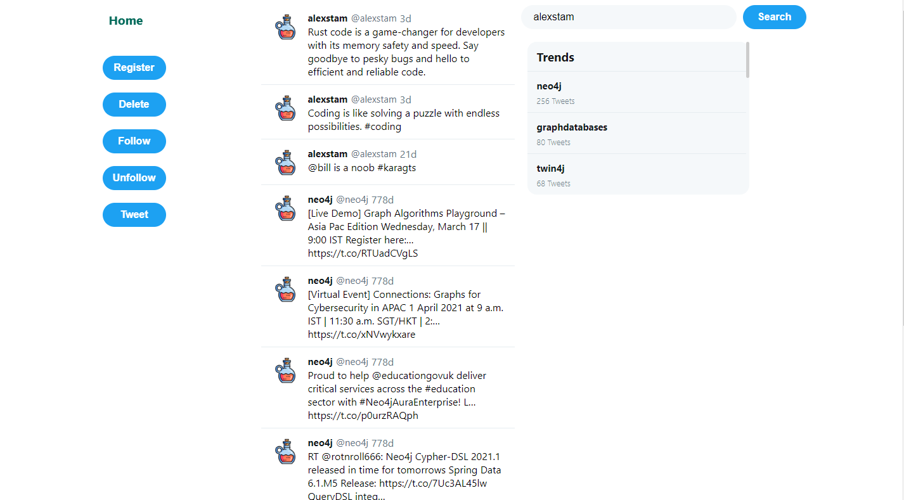

# Neo4j Twitter CRUD Application

This application is a simple CRUD (Create, Read, Update, Delete) application for twitter data, it connects with a neo4j database made from this dump 
[file](https://github.com/neo4j-graph-examples/twitter-v2/tree/main/data)

## The Stack

These are the components of our Web Application:
* Application Type: Python-Web Application
* Web framework: [Flask](https://palletsprojects.com/p/flask/)
* Database: Neo4j
* Frontend: HTML, CSS
